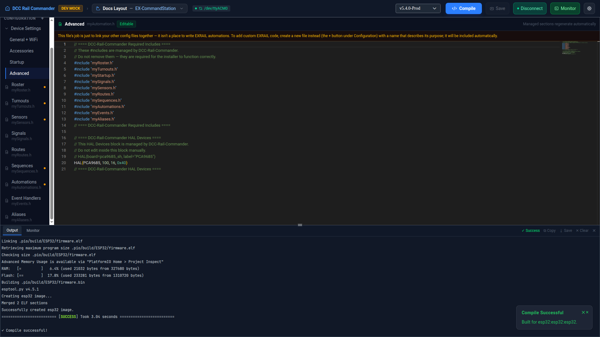

# Compile & Upload

## Compiling

Click **Compile** (or **Compile & Upload**, on production builds) in the title bar. Before building, the app:

1. Automatically saves every unsaved config file — you never need to Save first.
2. Confirms which firmware version is checked out, switching branches/tags if you changed the version selector.
3. Resolves the board's **FQBN** (the internal PlatformIO target identity) — normally already known from setup,
   but recovered automatically from `config.h`'s device header, or from `MOTOR_SHIELD_TYPE`, or by rescanning
   connected boards, if it's ever missing.

The build itself runs against the bundled, fully offline PlatformIO toolchain — no network access, no cloud
build service. A progress bar appears above the editor, and the live build log streams into the **Output**
panel at the bottom of the screen.

When it finishes, the Output tab shows **✓ Success** or **✗ Failed**. Use **⧉ Copy** or **⭳ Save** on a failed
build to share the log, or **✕ Clear** to reset it before the next attempt.

!!! tip "Compile is always real"
    Compiling never depends on a device being connected, and mock/dev mode never fakes it — it's the same
    bundled PlatformIO build every time, hardware attached or not. Only the *upload* step needs a real board.

## Strict Compile

An optional [Preferences](preferences.md) setting: when on, **Compile** is disabled while any open config file
still has an editor error (a red squiggle in a Raw Monaco view, or an equivalent Visual-mode validation
failure) — catching mistakes before they reach the compiler rather than after. Off by default.

## Uploading

On production (non-mock) builds, the title bar's Compile button becomes **Compile & Upload** — a successful
compile is immediately followed by flashing the connected board over its serial port. Nothing further to do:
if the compile output shows ✓ Success and a board is connected at the selected port, the upload runs
automatically as the next step.

!!! note "Mock/dev builds"
    In `--mock-device`/dev builds the button only ever reads **Compile** — upload is faked at the IPC layer so
    the UI and build pipeline can be exercised without a real board attached (see the **DEV MOCK** badge in the
    title bar). Compilation itself is identical to a production build.
