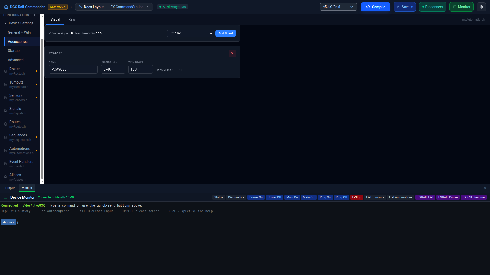

# Accessories

Accessories is where you declare I2C add-on boards — block sensor boards, I2C multiplexers, and PCA9555/
MCP23017/PCA9685 port-expander boards — that plug into your command station over I2C. It's not a separate
config file: it's a focused view onto the managed **HAL Devices** block inside `myAutomation.h`, kept as its
own row under Device Settings so it's unambiguous which part of that file you're editing.

Like the other Device Settings pages, it has a **Visual** tab (a form) and a **Raw** tab (the block's own text
in Monaco) — the Visual form is currently available for EX-CommandStation.

## VPin summary

At the top of the Visual tab, a summary line shows how many VPins are currently assigned across all declared
boards and the next free VPin — useful when choosing a **VPin Start** for a new board.

## Adding a board

Pick a board from the dropdown and click **Add Board**. The catalog includes:

- **RT DCD-16 Block Sensor** (Rosscoe) — a 16-pin sensor board.
- **RT I2C Isolated Multiplexer** (Rosscoe) — an 8-channel I2C multiplexer with no VPins of its own.
- **PCA9555** (generic) — a 16-pin sensor-role port expander.
- **MCP23017** (generic) — a 16-pin sensor-role port expander.
- **PCA9685** (generic) — a 16-pin servo-role port expander.

## Board fields

Each added board gets its own row, with fields that vary by board type:

| Field | Notes |
|---|---|
| **Name** | A friendly label for the board. |
| **I2C Address** | Either a dropdown of the board's jumper-selectable addresses, or a free-entry hex field bounded to the board's valid range, depending on the board type. |
| **Behind Multiplexer** | Only shown once at least one multiplexer board has been added. Set to route this board through a multiplexer's sub-bus instead of the top-level I2C bus. |
| **Channel** | Only shown once a multiplexer is selected above — which of the multiplexer's downstream channels this board sits on. |
| **VPin Start** | Only shown for boards that consume VPins. The board's pin range is shown alongside it (e.g. "Uses VPins 100–115"). |

Click the **×** button on a row to remove that board. Removing a multiplexer also clears the "Behind
Multiplexer"/"Channel" assignment on any board that was routed through it.

For sensor-role boards, an **Add N Sensors from this Device** button quick-adds that many entries to the
[Sensors](sensors.md) editor, one per pin, pre-filled with the board's VPin range.

## Conflict warnings

The form flags two kinds of problems inline, on the affected row:

- **Address conflicts** — another board shares the same I2C address on the same bus (or the same multiplexer
  channel).
- **VPin range overlaps** — this board's VPin range overlaps another board's.

## Raw tab

The Raw tab is scoped to just the HAL Devices block's text, not the whole `myAutomation.h` file — edits here
write back only to that managed block.
