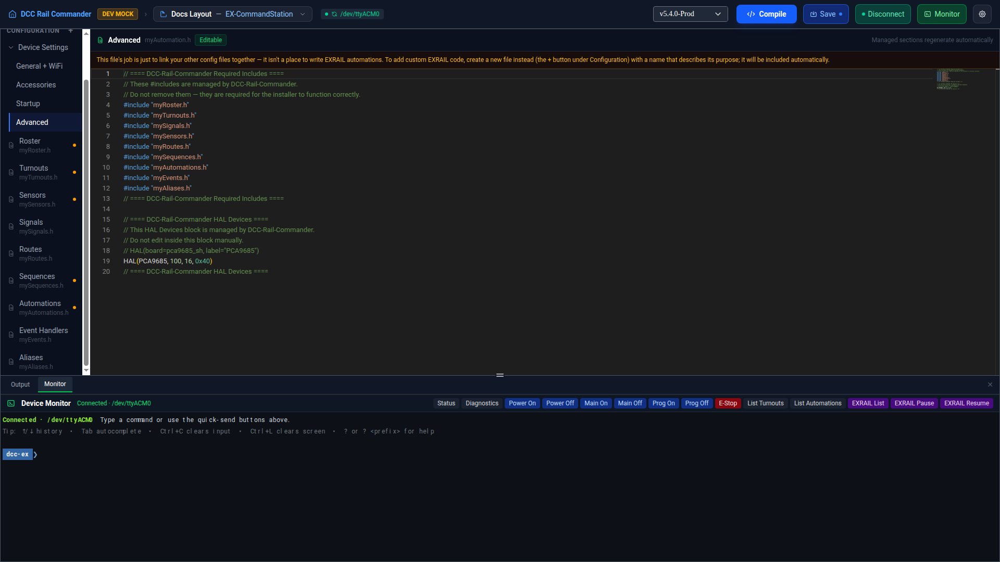

# Advanced

Advanced is the editor for `myAutomation.h` itself — the file that links all your other config files together.
Its auto-generated `#include` block pulls in every config file that has content, plus the HAL Devices block
edited over on [Accessories](accessories.md); anything else in it is free-form, hand-written EXRAIL code.

!!! note "Why \"Advanced\" and not \"Automation\""
    This row is deliberately not labeled "Automation" — that name is already taken by EXRAIL's own
    `AUTOMATION()` blocks, a different, user-facing concept covered on the [Automations](automations.md) page.

## Raw text only

Unlike the other Device Settings pages, Advanced has no Visual tab — it's always shown as raw text in the
Monaco editor. Once TrackManager and turnout defaults moved to [Startup](startup.md) and HAL Devices moved to
[Accessories](accessories.md), nothing structured was left in this file to justify one.

!!! warning "Don't hand-edit this file for automations"
    The app shows an inline note directly above the editor: this file's job is just to link your other config
    files together — it isn't a place to write EXRAIL automations. To add custom EXRAIL code, create a new file
    instead, using the **+** button under Configuration in the workspace sidebar, with a name that describes its
    purpose. It's included automatically — you don't need to edit `myAutomation.h` to wire it in.
