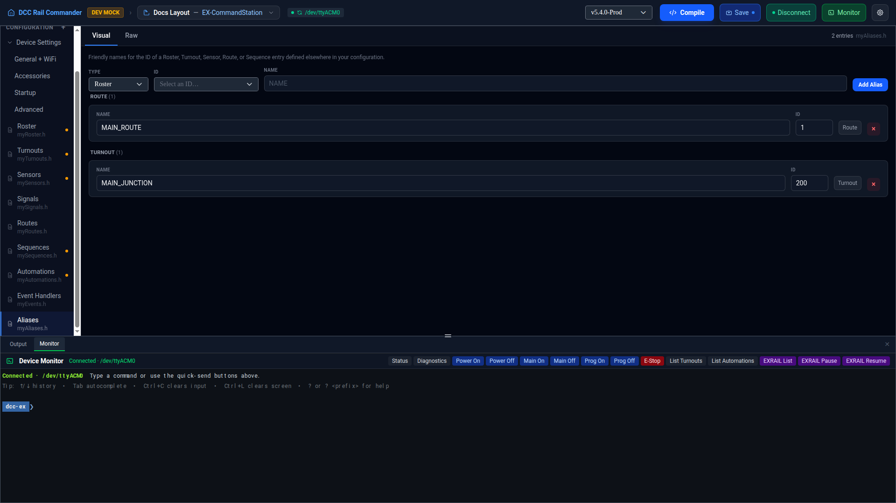

# Aliases

The Aliases editor manages `myAliases.h` — friendly names for the ID of a Roster, Turnout, Sensor, Route,
Sequence, or Automation entry defined elsewhere in your configuration, so other config files and EX-RAIL
scripts can refer to it by name instead of a raw numeric ID.

## Layout

Unlike Routes, Sequences, Automations, and Event Handlers, the Aliases editor has no Blocks canvas — the
**Visual** tab is a form: an **Add Alias** row at the top, and the existing aliases below it, grouped by
target type (Roster, Turnout, Sensor, Route, Sequence, Automation) and sorted alphabetically by name within
each group. Each group header shows the group's name and entry count.

## Adding an alias

1. Choose the target **Type** from the dropdown.
2. Choose the target **ID** from the second dropdown — it lists only IDs of that type that don't already have
   an alias, refreshed each time you open it.
3. Type a **Name** for the alias.
4. Click **Add Alias**, or press **Enter** while in the Name field.

If no ID is selected, or the name/ID combination is invalid, an error message appears above the list instead
of adding the alias.

## Alias fields

| Field | Notes |
|---|---|
| **Name** | Must start with a letter or underscore, and contain only letters, numbers, and underscores. Can't collide with an EXRAIL command name. |
| **ID** | The numeric ID of the target Roster/Turnout/Sensor/Route/Sequence/Automation entry. |
| **Type** | Shown as a read-only badge on each row; set when the alias is created and can't be changed afterward from the Visual tab. |

## Editing and removing

Edit a row's **Name** or **ID** directly and it commits when you leave the field (on blur). An edit that fails
validation shows an error message and reverts the whole list to its last valid state, so no other row's edit
is lost in the process. Click **×** on a row to remove that alias.

## Raw view

Switch to the **Raw** tab to edit `myAliases.h` directly in a Monaco editor. Each alias is written as
`ALIAS(name, id)`, with its target type recorded in a trailing `// type: <Type>` comment so the Visual tab can
round-trip it back into the correct group.
