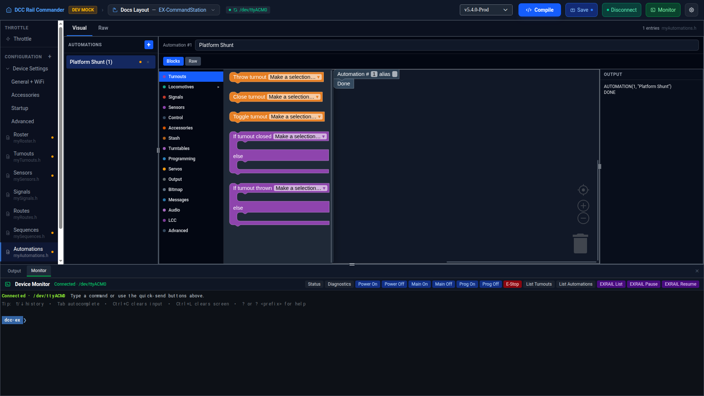

# Automations

The Automations editor manages `myAutomations.h` — EX-RAIL's own `AUTOMATION()` blocks, edited the same way as
[Routes](routes.md) and [Sequences](sequences.md): a sidebar list plus a per-entry **Blocks** / **Raw**
toggle, a Blockly canvas with a nested category palette and always-visible flyout, and an always-visible
compiled-output pane. See [Routes → Blocks and Raw, per route](routes.md#blocks-and-raw-per-route) and
[Routes → The Blocks canvas](routes.md#the-blocks-canvas) for how that works; this page only covers what's
different for automations.

!!! note "myAutomations.h vs. the Advanced section"
    This page's `myAutomations.h` (plural) holds EX-RAIL's own `AUTOMATION()` blocks — a third kind of
    task entry point alongside `ROUTE()` and `SEQUENCE()`. It is **not** the same file as the singular
    `myAutomation.h` edited in the **Advanced** section of Device Settings, which is a different, app-internal
    file that links your other config files together and is not itself named after EX-RAIL's `AUTOMATION()`
    concept. See [Advanced](../config/advanced.md) for that file.

## Layout

The left sidebar lists every automation by description (or `Automation <id>` if it has none); an amber dot
marks any entry with no alias set while **Strict aliases** is enabled (see [Aliases](#aliases) below). Click a
row to load it, or the **×** on a row to remove it. Click **+** to add a new automation.

## Adding an automation

Click **+**. A new automation is created with the next unused ID and the description "New Automation", and is
selected for editing immediately with an empty body. New IDs come from the same pool as Routes and Sequences —
see [Routes → Shared ID pool](routes.md#shared-id-pool-with-sequences-and-automations).

## Automation fields

| Field | Notes |
|---|---|
| **ID** | Must be unique across Routes, Sequences, and Automations (1–32767; 0 is reserved). |
| **Description** | Written as the quoted string in `AUTOMATION(id, "description")`, the same shape as a Route's header. |
| **Alias** | Optional. See [Aliases](#aliases) below. |

## Blocks and Raw, per automation

Same mechanics as Routes: each automation has its own independent **Blocks** / **Raw** toggle, and if an
automation's Raw text can't be converted to blocks, its **Blocks** tab is disabled with an explanatory tooltip
rather than losing or altering the text.

## Aliases

Any automation can have an alias — a name other config files and EX-RAIL scripts can use instead of the raw
automation ID. Aliases must start with a letter or underscore and contain only letters, numbers, and
underscores; they can't collide with an EXRAIL command name.

!!! note "Strict aliases"
    An app preference: when enabled, any automation without an alias is flagged (an amber dot in the sidebar,
    and a save is blocked with an error) until you give it one.
