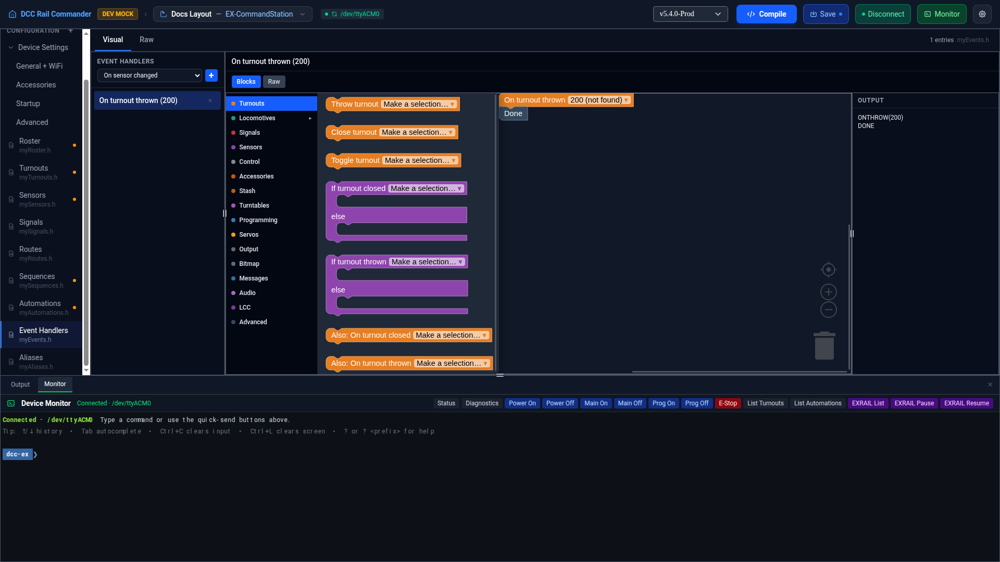

# Event Handlers

The Event Handlers editor manages `myEvents.h` — EX-RAIL blocks that run in response to something happening
(a sensor changing, a DCC accessory being activated, a fast clock tick, and similar), rather than being
called by ID like a [Route](routes.md), [Sequence](sequences.md), or [Automation](automations.md). An event
handler has no ID, alias, or separate description field — the whole on-disk block, header line included, is
edited as one unit.

## Layout

The left sidebar has an **Add** control at the top — a dropdown of handler types, grouped by category, next
to a **+** button — above the list of handlers already in your file. Each row shows a friendly label built
from the handler type and its arguments (for example "On sensor changed (200)"). Click a row to load it, or
the **×** on a row to remove it.

## Adding an event handler

Pick a handler type from the dropdown, then click **+**. The new entry is seeded with default field values and
a bare `DONE` body, and is selected for editing immediately.

## Available handler types

The dropdown lists every handler type available given your current configuration, grouped by category. Some
examples:

| Type | Label | Arguments |
|---|---|---|
| `ONSENSOR` | On sensor changed | Sensor |
| `ONCHANGE` | On rotary encoder changed | Sensor |
| `ONBUTTON` | On button pressed | Sensor |
| `ONBITMAP` | On bitmap sensor changed | Sensor |
| `ONBLOCKENTER` / `ONBLOCKEXIT` | On loco enters/exits block | Block ID |
| `ONACTIVATE` / `ONDEACTIVATE` | On DCC accessory activate/deactivate | Address, Sub-address |
| `ONACTIVATEL` / `ONDEACTIVATEL` | On DCC accessory activate/deactivate (linear) | Linear address |
| `ONCLOSE` / `ONTHROW` | On turnout closed/thrown | Turnout |
| `ONRED` / `ONAMBER` / `ONGREEN` | On signal red/amber/green | Signal |
| `ONCLOCKTIME` / `ONCLOCKMINS` / `ONTIME` | On fastclock time/minutes/minute-of-day | Hours+Minutes, Minutes, or Minute in day |
| `ONOVERLOAD` | On track overload | Track |
| `ONROTATE` | On turntable rotated | Turntable |
| `ONACON` / `ONACOF` | On MERG CBUS event received | Event ID |

A handler that needs a turnout, sensor, signal, or similar reference is only offered once at least one of that
kind exists in your project.

## Blocks and Raw, per handler

Each event handler has its own independent **Blocks** / **Raw** toggle, using the same underlying canvas as
[Routes](routes.md#the-blocks-canvas): a nested category palette, an always-visible flyout, and a read-only
output pane showing the compiled EXRAIL text. If a handler's hand-typed Raw text can't be converted to blocks,
its **Blocks** tab is disabled and greyed out with an explanatory tooltip ("This block can't be edited
visually yet — switch to Raw.") rather than losing or altering the text.

## Whole-file Raw view

The **Raw** tab at the top of the editor shows the entire `myEvents.h` file in a Monaco editor. A handler's
own **Raw** tab, by contrast, shows just that handler's full text — header line and body together, since an
event handler has no separate structured header to split out.
