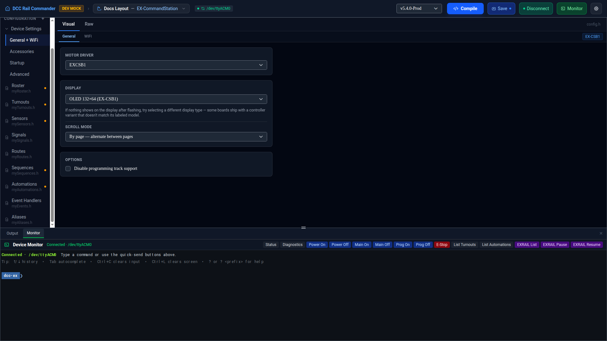

# General + WiFi

General + WiFi is where you set up your command station's core hardware — motor driver, display, and WiFi/
Ethernet networking. It edits `config.h` (EX-CommandStation) or `myConfig.h` (EX-IOExpander, via its own
equivalent form); this page focuses on the EX-CommandStation form, since setting up a command station is the
primary flow through the app.

Like the other Device Settings pages, this one has a **Visual** and a **Raw** tab. Visual is a form; Raw is a
Monaco editor on the file's actual C++ text, for anything the form doesn't cover.

!!! note "Default tab"
    Which tab a config editor opens on (Visual or Raw) follows an app-wide [Preferences](../preferences.md)
    setting, until you pick a tab yourself for that file in the current session.

## General tab

| Field | Notes |
|---|---|
| **Motor Driver** | The motor shield/driver board fitted to your hardware. Populated from your checked-out firmware's `MotorDrivers.h`, falling back to a built-in list if that can't be read. |
| **Display** | None, LCD 16×2, LCD 20×4, OLED 128×32, OLED 128×64, or OLED 132×64 (EX-CSB1). |
| **Scroll mode** | Only shown once a display is selected: Continuous (fill screen, scroll smoothly), By page (alternate between pages), or By row (move up one row at a time). |
| **Enable WiFi** | Turns on the board's WiFi. Hidden on EX-CSB1 boards, where WiFi is always on. |
| **Enable Ethernet** | Only shown on non-ESP32 boards. Enabling it turns Enable WiFi off, and vice versa — the two are mutually exclusive. |
| **Disable EEPROM support** | Hidden on EX-CSB1 boards, where it doesn't apply. |
| **Disable programming track support** | Turns off PROG track support. |

!!! tip "Nothing on the display after flashing?"
    Try a different display type — some boards ship with a controller variant that doesn't match its labeled
    model.

!!! note "ESP32 boards"
    On an ESP32-based board, WiFi is always enabled and EEPROM support is always disabled — these follow the
    board automatically and aren't user-editable options here.

An **EX-CSB1** badge appears in the tab bar when the app detects an EX-CSB1 board (by device name, selected
motor driver, or the `MOTOR_SHIELD_TYPE` already in `config.h`). On EX-CSB1, the Motor Driver list is narrowed
to EX-CSB1-specific drivers, and picking the stacked driver (`EXCSB1_WITH_EX8874`) is what enables Track C/D
over on the [Startup](startup.md) page.

## WiFi tab

If WiFi isn't enabled (and the board isn't an EX-CSB1, where it's always on), this tab shows a reminder to
enable it on the General tab first — the rest of the fields below only appear once WiFi is on.

| Field | Notes |
|---|---|
| **Mode** | **Access Point** (the command station creates its own network) or **Station** (it joins an existing network). |
| **Hostname** | Defaults to `dccex` if left blank. |
| **Network SSID** / **Custom network name** | Required in Station mode. Optional in Access Point mode — leave blank to keep the firmware's default network name. |
| **Password** | Optional in Access Point mode (keeps the firmware default password if blank). Use **Show**/**Hide** next to the field to reveal it while typing. |
| **Channel (1–11)** | Access Point mode only. |

!!! note "Access Point defaults"
    In Access Point mode, the firmware's built-in defaults are network name `DCCEX` and password `PASS`. Leave
    the Custom network name / Custom password fields blank to use them, or click **Reset to defaults** to clear
    any overrides you've entered.

## Raw tab

Switch to **Raw** to edit `config.h` (or `myConfig.h`) directly in a Monaco editor — useful for options the
Visual form doesn't expose. There's no separate visual editor for EX-IOExpander's `myConfig.h` fields covered
here beyond its own form; the Raw tab is always available regardless of product.
