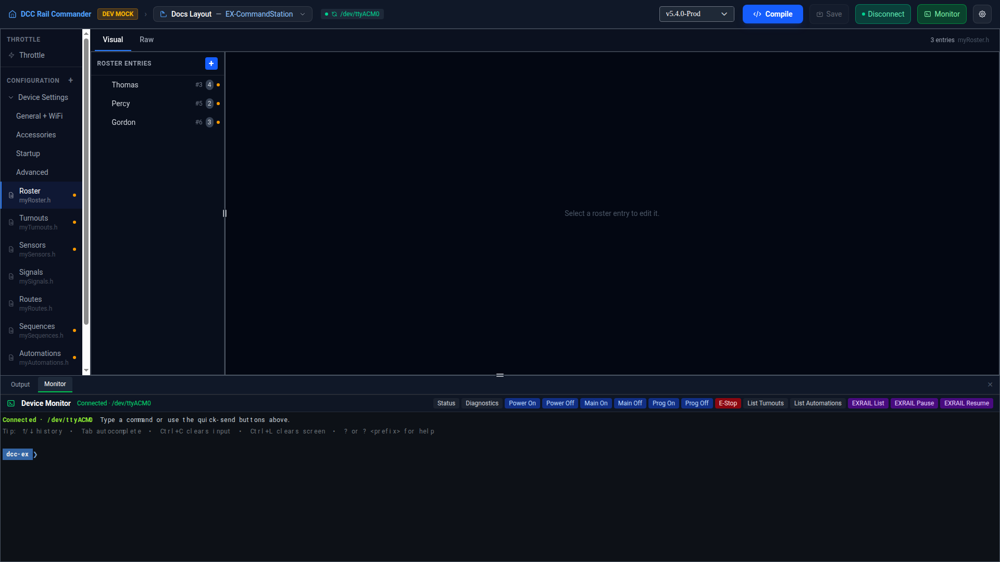

# Roster

The Roster editor manages your locomotive roster — `myRoster.h` — the list of DCC addresses your throttle and
EX-RAIL automations can reference by name.

## Layout

The left sidebar lists every roster entry as a tree. Locomotives that share a function list (see
[Shared function lists](#shared-function-lists) below) are nested under a `#define` group node; every other
locomotive appears at the top level. Each locomotive row shows its name, DCC address, and a badge with its
function count; an amber dot appears next to any entry with no alias set while **Strict aliases** is enabled
(see [Aliases](#aliases) below). Click **+** at the top of the sidebar to add a new entry, or click any row to
load it into the detail panel on the right.

Right-click a locomotive row for **Clone** or **Delete**; right-click a group row for **Rename Group**.

## Adding a locomotive

Click **+**. A new entry is created with the next unused DCC address (or `1` if the roster is empty), named
"New Loco `<address>`", and selected for editing immediately.

## Locomotive fields

| Field | Notes |
|---|---|
| **DCC Address** | Must be unique across the roster — saving with a duplicate address shows an error naming the conflicting locomotive. |
| **Name** | Display name shown in the roster list and the app's throttle. |
| **Alias** | Optional. See [Aliases](#aliases) below. |
| **Comment** | Optional; written to `myRoster.h` after `//` on that entry's line. |

## Functions

Each locomotive (that doesn't belong to a shared function list) has its own list of up to 29 functions
(F0–F28). For each function you can set:

- **Name** — left blank and disabled when **No Fn** is checked.
- **Momentary** — the function is active only while held, not toggled on/off.
- **No Fn** — marks the slot as unused, keeping the function numbering intact without assigning a name.

Drag a function row by its handle to reorder it; use the row at the bottom (with the next free `F` number) to
add a new one, or press Enter while typing its name.

## Shared function lists

Locomotives that use identical function sets can share one `#define` macro instead of repeating it on every
entry. **Clone** on a locomotive that doesn't already have a shared list generates a new `#define` and converts
both the original and the clone to use it, grouping them under a group node in the sidebar. Cloning a
locomotive that already belongs to a group just adds another member to that same group.

Selecting a group node shows:

- **Macro Name** — the `#define` identifier itself; click **Edit** to rename it (must be a valid C identifier).
- **Friendly Name** — an optional display name shown in the sidebar instead of the raw macro name.
- The group's own function list, edited the same way as a standalone locomotive's.

Selecting a locomotive that belongs to a group shows a restricted editor instead of the full function list: DCC
Address, Name, Alias, and Comment stay editable, but the group's functions are shown read-only (with an
**→ Edit function list** shortcut to jump to the group). A locomotive in a group can still have its own
**Custom Functions**, added on top of the shared list without affecting other members of the group.

## Aliases

Any roster entry can have an alias — a name other config files and EX-RAIL scripts can use instead of the raw
DCC address. Aliases must start with a letter or underscore and contain only letters, numbers, and underscores;
they can't collide with an EXRAIL command name.

!!! note "Strict aliases"
    An app preference: when enabled, any roster entry without an alias is flagged (an amber dot in the sidebar,
    and an error if you try to save it without one).

## Raw view

Switch to the **Raw** tab to edit `myRoster.h` directly in a Monaco editor. Lines that can't be parsed back
into the visual model are automatically commented out with `// [INVALID]` and a toast notification appears so
you can find and fix them — they aren't discarded.
