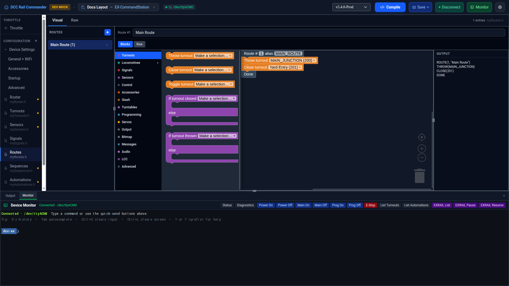
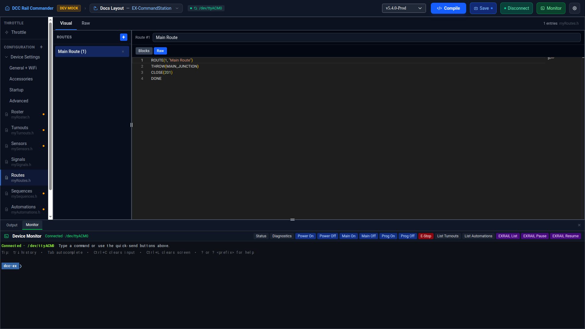

# Routes

The Routes editor manages `myRoutes.h` — your layout's `ROUTE()` blocks. Each route is a numbered,
optionally-named block of EX-RAIL steps that other parts of your script can jump to with a **Follow route/
sequence** block (`FOLLOW`, "effectively a GoTo") or call as a subroutine with **Call route/sequence** /
**Return** (`CALL`/`RETURN`, "with the expectation to return").

## Layout

The left sidebar lists every route by description (or `Route <id>` if it has none); an amber dot marks any
entry with no alias set while **Strict aliases** is enabled (see [Aliases](#aliases) below). Click a row to
load it into the detail panel, or the **×** on a row to remove it. Click **+** to add a new route.

The detail panel shows the route's ID and an editable **Description**, followed by a **Blocks** / **Raw**
toggle for that route's body (see [Blocks and Raw, per route](#blocks-and-raw-per-route) below).

## Adding a route

Click **+**. A new route is created with the next unused ID and the description "New Route", and is selected
for editing immediately with an empty body.

## Route fields

| Field | Notes |
|---|---|
| **ID** | Must be unique — see [Shared ID pool](#shared-id-pool-with-sequences-and-automations) below. |
| **Description** | Written as the quoted string in `ROUTE(id, "description")`. |
| **Alias** | Optional. See [Aliases](#aliases) below. |

## Shared ID pool with Sequences and Automations

!!! note "Routes, Sequences, and Automations share one numbering pool"
    Route, Sequence, and Automation IDs all come from a single pool: valid IDs are **1–32767**, and no two
    routes/sequences/automations may share an ID, regardless of type. ID **0** is reserved for the startup
    sequence (the code that runs before the first `ROUTE`/`SEQUENCE`/`AUTOMATION` in the script) and can't be
    assigned. Saving a route with an out-of-range or already-used ID shows a warning naming the conflict.

## Blocks and Raw, per route

Each route has its own **Blocks** / **Raw** toggle, independent of every other route's — one route can be in
Blocks mode while another is in Raw. If a route's hand-typed Raw text can't be represented as blocks (an
unrecognized or malformed EXRAIL command, for example), its **Blocks** tab is disabled and greyed out with an
explanatory tooltip ("This body can't be edited visually yet — switch to Raw."); the route itself is never
lost or altered, it just can't be opened visually until you fix or simplify it in Raw.

## The Blocks canvas

Blocks mode is built on Google Blockly. A nested category palette on the left (Turnouts, Sensors, Locomotives,
Accessories, Signals, Control, and more) drives an always-visible flyout of draggable blocks next to the
canvas — unlike Blockly's usual popup-and-close flyout, it never overlays the canvas. Drag a block from the
flyout onto the canvas and connect it under the route's hat block (or another block) to build up the sequence
of steps.

A read-only **Output** pane alongside the canvas always shows the exact EXRAIL text the current blocks
compile to, including the `ROUTE(id, "description")` header line — useful for checking what will actually be
written to `myRoutes.h` without leaving Blocks mode. A trailing `//` comment on a statement is preserved as a
native Blockly comment icon on that block.

## Whole-file Raw view

The **Raw** tab at the top of the editor (separate from each route's own per-row Blocks/Raw toggle) shows the
entire `myRoutes.h` file in a Monaco editor. A route's own **Raw** tab, by contrast, shows just that route's
`ROUTE(id, "description")` header line and body as one editable block of text — the header line is part of
the selectable/editable text, matching what the Blocks tab's hat node represents.

## Aliases

Any route can have an alias — a name other config files and EX-RAIL scripts can use instead of the raw route
ID. Aliases must start with a letter or underscore and contain only letters, numbers, and underscores; they
can't collide with an EXRAIL command name.

!!! note "Strict aliases"
    An app preference: when enabled, any route without an alias is flagged (an amber dot in the sidebar, and
    a save is blocked with an error) until you give it one.
