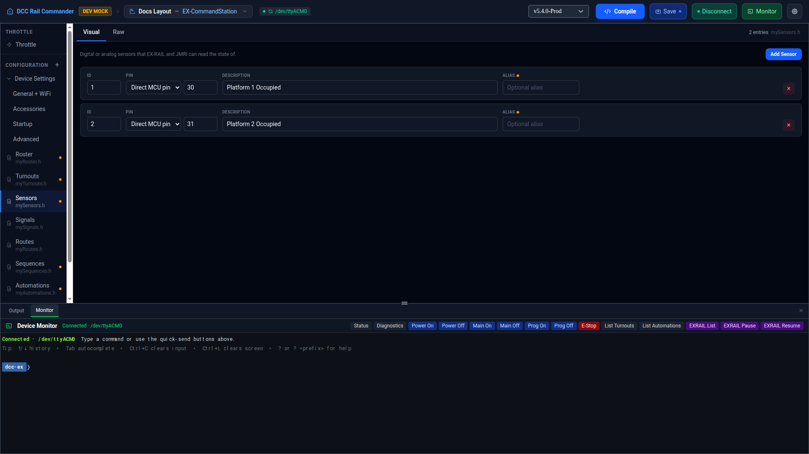

# Sensors

The Sensors editor manages `mySensors.h` — digital or analog sensors that EX-RAIL and JMRI can read the state
of.

## Visual and Raw views

Like other config files, Sensors has a **Visual** tab (the row list described below) and a **Raw** tab — a
Monaco text editor showing `mySensors.h` exactly as it will be written to disk. Edits made in either tab sync to
the other.

## Adding a sensor

Click **Add Sensor**. A new row is created with:

- **ID** — one higher than the last sensor's ID (`1` if the list is empty).
- **Pin** — the next free VPin at or above 100 (VPins 0–99 are conventionally reserved for physical MCU pins).
- **Description** — "New Sensor".

## Sensor fields

| Field | Notes |
|---|---|
| **ID** | The sensor's numeric identifier, as referenced elsewhere in EX-RAIL. |
| **Pin** | The VPin the sensor reads. Either type a raw pin number directly, or pick one of your configured accessory boards and a channel — the VPin is computed for you. See [Accessories](accessories.md). |
| **Description** | Free-text label for the sensor. |
| **Alias** | Optional name other config files and EX-RAIL scripts can use instead of the raw ID. See [Aliases](aliases.md). |

Click **×** on a row to remove that sensor.

## Aliases and Strict aliases

Each row has its own **Alias** field, backed by the same alias mechanism used across the app: letters, numbers,
and underscores only, must start with a letter or underscore, and can't be an EX-RAIL command name. Renaming a
sensor's ID carries its existing alias forward to the new ID automatically.

!!! note "Strict aliases"
    An app preference: when enabled, a row with no alias shows an amber dot next to its Alias label, and no
    other field on that row (ID, Pin, or Description) can be saved until an alias is set — the edit reverts and
    a toast explains why.

## Raw view

The Raw tab shows `mySensors.h` as `SENSOR(id, pin, "description")` declarations.

!!! note "JMRI_SENSOR bulk declarations"
    A `JMRI_SENSOR(vpin, count)` line — which bulk-declares a run of sensors starting at `vpin` — is read into
    the Visual list as individual sensor rows (one per pin in the range). Saving from the Visual tab afterward
    rewrites that block as individual `SENSOR(...)` lines rather than preserving the original bulk form.
