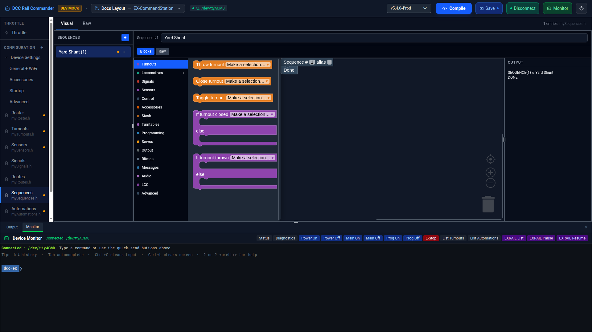

# Sequences

The Sequences editor manages `mySequences.h` — reusable blocks of EX-RAIL steps that a [Route](routes.md) or
[Automation](automations.md) jumps to with a **Follow route/sequence** block, or calls as a subroutine with
**Call route/sequence** / **Return** and returns from when done.

Sequences use the same Blocks/Raw editing model as Routes — a per-row **Blocks** / **Raw** toggle, a Blockly
canvas with a nested category palette and always-visible flyout, and an always-visible compiled-output pane.
See [Routes → Blocks and Raw, per route](routes.md#blocks-and-raw-per-route) and
[Routes → The Blocks canvas](routes.md#the-blocks-canvas) for how that works; this page only covers what's
different for sequences.

## Layout

The left sidebar lists every sequence by description (or `Sequence <id>` if it has none); an amber dot marks
any entry with no alias set while **Strict aliases** is enabled (see [Aliases](#aliases) below). Click a row
to load it, or the **×** on a row to remove it. Click **+** to add a new sequence.

## Adding a sequence

Click **+**. A new sequence is created with the next unused ID and the description "New Sequence", and is
selected for editing immediately with an empty body. New IDs come from the same pool as Routes and
Automations — see [Routes → Shared ID pool](routes.md#shared-id-pool-with-sequences-and-automations).

## Sequence fields

| Field | Notes |
|---|---|
| **ID** | Must be unique across Routes, Sequences, and Automations (1–32767; 0 is reserved). |
| **Description** | Optional. Unlike a Route's quoted description, a Sequence's description is written as a trailing `// description` comment after the `SEQUENCE(id)` header line. |
| **Alias** | Optional. See [Aliases](#aliases) below. |

## Blocks and Raw, per sequence

Same mechanics as Routes: each sequence has its own independent **Blocks** / **Raw** toggle, and if a
sequence's Raw text can't be converted to blocks, its **Blocks** tab is disabled with an explanatory tooltip
rather than losing or altering the text.

## Aliases

Any sequence can have an alias — a name other config files and EX-RAIL scripts can use instead of the raw
sequence ID. Aliases must start with a letter or underscore and contain only letters, numbers, and
underscores; they can't collide with an EXRAIL command name.

!!! note "Strict aliases"
    An app preference: when enabled, any sequence without an alias is flagged (an amber dot in the sidebar,
    and a save is blocked with an error) until you give it one.
