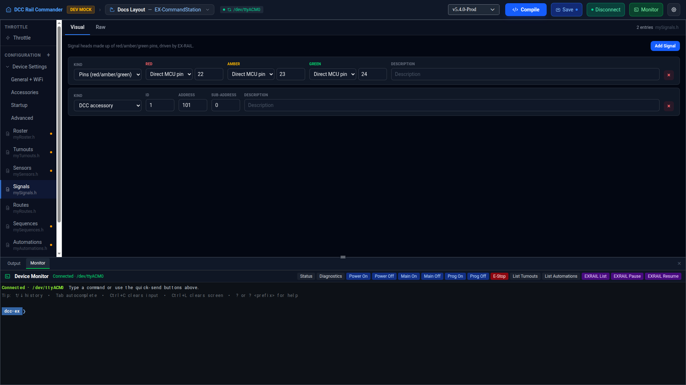

# Signals

The Signals editor manages `mySignals.h` — signal heads made up of red/amber/green pins, driven by EX-RAIL.

## Visual and Raw views

Like other config files, Signals has a **Visual** tab (the row list described below) and a **Raw** tab — a
Monaco text editor showing `mySignals.h` exactly as it will be written to disk. Edits made in either tab sync to
the other.

## Adding a signal

Click **Add Signal**. A new row is created as a **Pins (red/amber/green)** signal with its Red, Amber, and
Green pins set to `0` and an empty description — set the real pin numbers before saving.

## Signal kinds

Each row has a **Kind** dropdown:

| Kind | Fields |
|---|---|
| **Pins (red/amber/green)** | **Red**, **Amber**, **Green** — three VPins that drive the signal's LEDs directly. Each has its own picker: type a raw pin number, or pick one of your configured accessory boards and a channel to have the VPin computed for you. See [Accessories](accessories.md). |
| **DCC accessory** | **ID**, **Address**, **Sub-Address** — identifies a DCC accessory decoder-controlled signal. |

Switching a row's Kind converts it to the other shape, keeping only the **Description**; the two kinds share no
other field. Every row also has a **Description** field, and a **×** button to remove it.

## Raw view

The Raw tab shows `mySignals.h` as `SIGNAL(red, amber, green)` lines for Pins signals and
`DCC_SIGNAL(id, addr, subAddr)` lines for DCC accessory signals.
