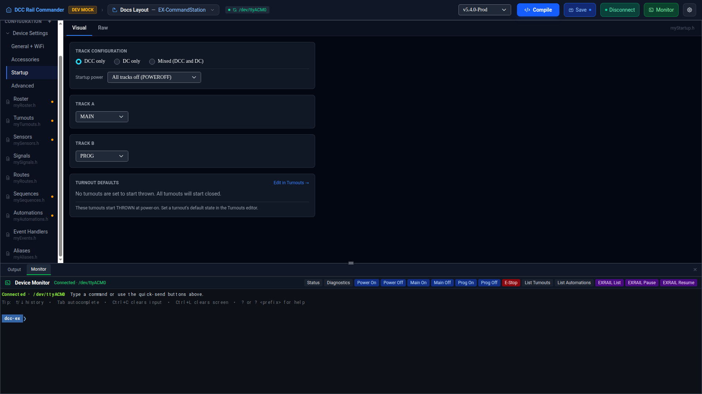

# Startup

Startup controls everything that happens automatically at power-on: track power and mode (`myStartup.h`'s
TrackManager block), and a read-only summary of which turnouts start thrown.

Like the other Device Settings pages, it has a **Visual** tab (two forms) and a **Raw** tab (the managed
sections of `myStartup.h` in Monaco) — Visual is currently available for EX-CommandStation.

## Track Configuration

| Field | Notes |
|---|---|
| **Track mode** | **DCC only**, **DC only**, or **Mixed (DCC and DC)** — sets every track's type at once, except in Mixed mode where each track picks its own type. |
| **Startup power** | **All tracks on** (`POWERON`), **Individual tracks** (`SET_POWER`, lets you set each track's power below), or **All tracks off** (`POWEROFF`). |

## Track rows

Track A and Track B are always shown; **Track C and Track D only appear when a stacked motor shield is
detected** — this is read-only here, derived from the motor driver selected on the
[General + WiFi](general-wifi.md) page. Selecting `EXCSB1_WITH_EX8874` there is the only way to enable Track
C/D.

Each track row has:

| Field | Notes |
|---|---|
| **Type** (DCC/DC) | Only shown in Mixed track mode. |
| **Mode** | Options depend on the track's type — DCC tracks: `MAIN`, `MAIN_INV`, `MAIN_AUTO`, `PROG`, `NONE`; DC tracks: `DC`, `DC_INV`, `DCX`, `NONE`. |
| **Power** (ON/OFF) | Only shown when Startup power is set to Individual tracks. |
| **Loco / Cab address** | Only shown for DC tracks. |

## Turnout Defaults

A read-only summary of every turnout whose default state is **THROWN** at power-on — turnouts not listed here
start closed. This panel doesn't let you change anything directly; click **Edit in Turnouts →** to jump to the
[Turnouts](turnouts.md) editor, which is where each turnout's default state is actually set.

## Raw tab

Switch to **Raw** to view/edit `myStartup.h` directly. Its managed sections regenerate automatically from the
Visual forms above and from turnout defaults, so hand-edits to those sections can be overwritten the next time
something changes them from the Visual side.
