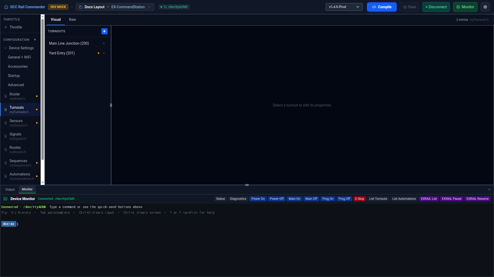
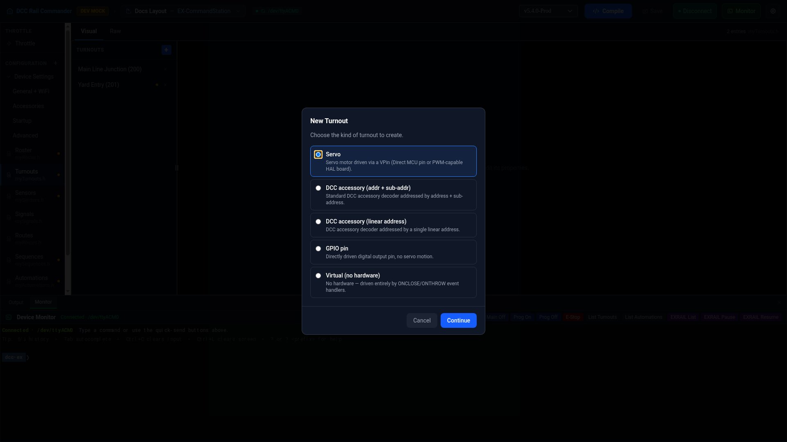
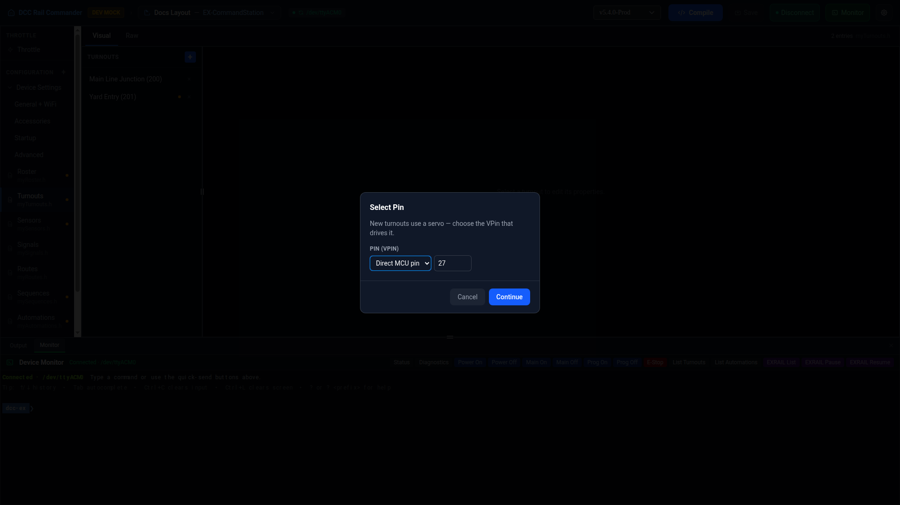
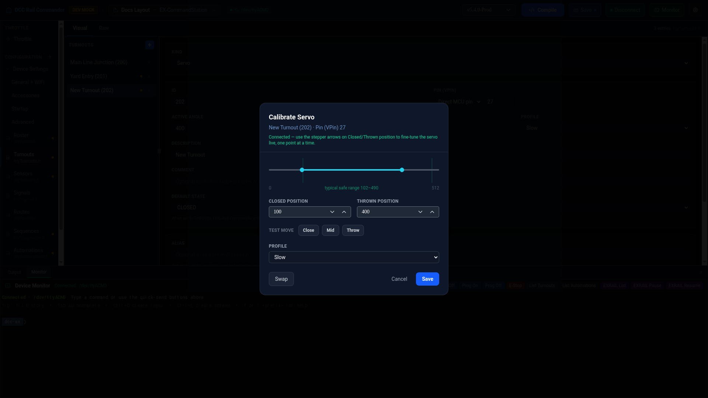

# Turnouts

The Turnouts editor manages `myTurnouts.h` — every turnout your layout controls, whatever drives it: a servo,
a DCC accessory decoder, a GPIO pin, or no hardware at all.

## Layout

The left sidebar lists every turnout by description (or `Turnout <id>` if it has none); an amber dot marks any
entry with no alias set while **Strict aliases** is enabled (see [Aliases](#aliases) below). Click a row to
load it into the detail panel, or the **×** on a row to delete it (with a confirmation prompt). Click **+** to
add a new turnout.

## Adding a turnout

Click **+**. A **New Turnout** dialog opens first, asking which kind to create:

| Kind | Description |
|---|---|
| **Servo** *(preselected)* | Servo motor driven via a VPin (a direct MCU pin, or a channel on a PWM-capable HAL board). |
| **DCC accessory (addr + sub-addr)** | Standard DCC accessory decoder, addressed by address + sub-address. |
| **DCC accessory (linear address)** | DCC accessory decoder addressed by a single linear address. |
| **GPIO pin** | Directly driven digital output pin — no servo motion. |
| **Virtual (no hardware)** | No hardware; driven entirely by `ONCLOSE`/`ONTHROW` event handlers elsewhere. |

Choosing **Servo** opens a second dialog to pick the driving pin before the entry is created:

The new turnout is created with the next unused turnout ID (or `200` if the list is empty). A new **Servo**
turnout jumps straight into the servo calibration dialog (below) so you can set a sensible position before
doing anything else.

## Turnout fields

Every kind shares **ID** (must be unique — saving with a duplicate ID shows an error naming the conflicting
turnout), **Description**, **Comment**, and **Default State**; the rest depend on kind:

| Kind | Kind-specific fields |
|---|---|
| **Servo** | Pin (VPin), Active Angle, Inactive Angle, Profile (`Instant`, `Fast`, `Medium`, `Slow`, `Bounce`). |
| **DCC accessory (addr + sub-addr)** | Address, Sub-Address. |
| **DCC accessory (linear address)** | Linear Address. |
| **GPIO pin** | Pin (VPin). |
| **Virtual** | None — just ID/Description/Comment/Default State. |

Changing **Kind** on an existing turnout converts it to the new kind's shape, generating fresh defaults for any
newly-required fields while preserving ID, Description, Comment, and Default State. Switching to Servo this way
also opens the pin-picker dialog to choose the driving pin.

## Default State and Startup

**Default State** is `CLOSED` or `THROWN`. Setting it to `THROWN` causes DCC Rail Commander to emit a
`THROW(...)` call in an `AUTOSTART` block in `myStartup.h`, using the turnout's alias name if it has one,
otherwise its numeric ID. See [Startup](startup.md) for how that file's generated blocks work.

## Servo calibration

For a Servo turnout, the detail panel shows a **Configuration Summary** with the current pin, angles, and
profile, plus an angle bar visualizing where the inactive (red) and active (green) positions fall between 0
and 512. Click **Test/Calibrate Servo…** to open the live calibration dialog:

- A range slider (with a shaded typical-safe-range guide around 102–490) sets the **Closed position** and
  **Thrown position** together; dragging it only changes the candidate values, it never moves the servo.
- The **Closed position** / **Thrown position** numeric fields can be typed directly, or fine-tuned one step at
  a time with their spin-button/arrow-key stepper — a stepper move sends a live one-off command to the servo,
  so you can dial it in incrementally.
- **Close** / **Mid** / **Throw** send a one-off test move to the currently-set position, using the selected
  **Profile**.
- **Swap** exchanges the Closed and Thrown values without moving the servo.
- **Profile** here is the same list as on the detail panel and is applied on Save.

Live test moves need the device connected over serial; the dialog shows its connection status (connecting,
connected, unavailable, or error) at the top, and the last command actually sent, so you can tell whether a
move was sent at all versus sent but ignored by the firmware. **Save** validates both positions before writing
them back to the turnout; **Cancel** discards the dialog's changes.

## Aliases

Any turnout can have an alias — a name other config files and EX-RAIL scripts can use instead of the raw
turnout ID. Aliases must start with a letter or underscore and contain only letters, numbers, and underscores;
they can't collide with an EXRAIL command name.

!!! note "Strict aliases"
    An app preference: when enabled, any turnout without an alias is flagged (an amber dot in the sidebar, and
    an error if you try to save it without one).

## Raw view

Switch to the **Raw** tab to edit `myTurnouts.h` directly in a Monaco editor. Lines that can't be parsed back
into the visual model are automatically commented out with `// [INVALID]` and a toast notification appears so
you can find and fix them — they aren't discarded.
