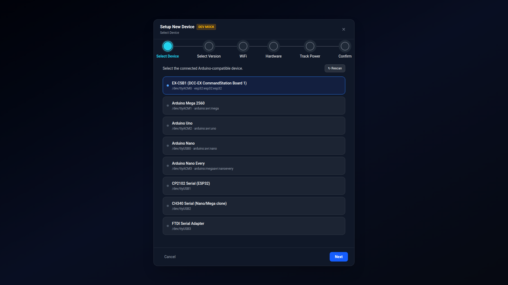
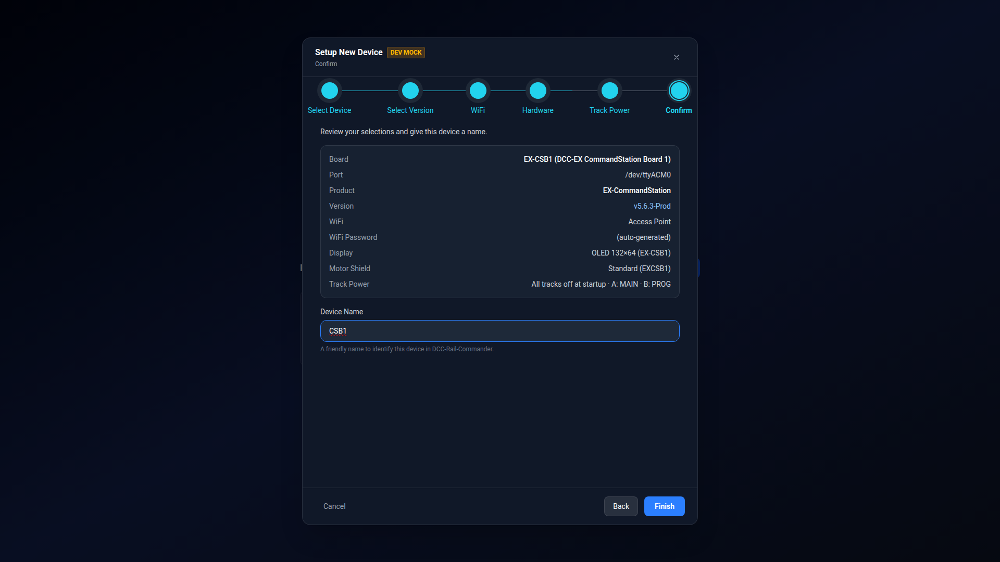

# New Device Wizard

The **New Device Wizard** opens from the home screen's **New Device** card (or **+ New Device** in the
workspace's device menu, once you have at least one device set up). It walks a physical board through
everything needed to produce a working firmware configuration: which board, which firmware version, and — for
boards that support it — WiFi, display/motor hardware, and startup track power.

Currently the wizard provisions **EX-CommandStation** firmware; EX-IOExpander and EX-Turntable are configured
by loading or importing an existing folder instead (see [Getting Started](getting-started.md)).

## Step 1 — Select Device

The wizard scans for connected Arduino-compatible boards and lists each one with its port and, where known,
its FQBN (the board identity string used internally). Click a board to select it, or **↻ Rescan** if your board
isn't listed yet — USB enumeration can occasionally lag a few seconds behind a fresh plug-in.

If a selected board isn't supported by EX-CommandStation, the wizard tells you before you can continue.

## Step 2 — Select Version

Pick the EX-CommandStation firmware version (Git tag) to install. The list is fetched live from the product's
repository; the latest **Prod** tag is marked **(Recommended)** and preselected. Choosing a version here
clones (or reuses an already-cloned copy of) that repository at the chosen tag — this is the only step that
needs network access, and only if that version hasn't been fetched before.

## Steps 3–5 — WiFi, Hardware, Track Power *(EX-CSB1 boards only)*

These three steps only appear for **EX-CSB1** boards, which have onboard WiFi, an OLED display, and (in some
variants) a stacked motor shield. Any other supported board skips straight from Select Version to Confirm —
there's nothing hardware-specific to set up.

### WiFi

Choose **Access Point** (the board creates its own WiFi network — the normal choice for a standalone layout
controller) or **Station** (the board joins an existing network you specify).

- **Hostname** — defaults to `dccex`.
- **Network Name (SSID)** and **Password** — required for Station mode. For Access Point mode, leave either
  blank to use an auto-generated `DCCEX_xxxxxx` name and `PASS_xxxxxx` password (the `xxxxxx` suffix comes from
  the board's WiFi MAC address, and both are shown on the EX-CSB1's OLED screen after it boots). Click **Show**
  next to the password field to reveal what you've typed.
- **Channel** — Access Point mode only, 1–11.

### Hardware

Two independent settings share this step:

- **Display Type** — EX-CSB1 boards typically use a 132×64 OLED, preselected by default. Change it if your
  screen doesn't display correctly after flashing (some boards ship with a different controller variant than
  their labeled model). Choosing anything other than **None** also shows a **Scroll Mode** option (Continuous,
  By page, or By row).
- **Stacked motor shield** — a checkbox that only appears for boards that support one. Checking it selects the
  `EXCSB1_WITH_EX8874` motor driver instead of the standard `EXCSB1` driver, and adds Track C/D to the Track
  Power step below.

### Track Power

The same live form used later in [Startup](config/startup.md) — set DCC/DC/Mixed mode per track, and whether
tracks power on, off, or individually at startup. Anything you don't touch here falls back to firmware
defaults (**all tracks off at startup**, per-track mode `MAIN`/`PROG`) when you review it on the Confirm step.

## Final Step — Confirm

A summary of every choice made in the earlier steps — board, port, product, version, and (for EX-CSB1 boards)
WiFi, display, motor shield, and track power. Give the device a **Device Name**: a friendly label used to tell
this configuration apart in the home screen's Recent Devices grid and the workspace's device switcher. EX-CSB1
boards default to **CSB1**; the field is focused and ready to type over.

Click **Finish** to provision the device — this writes the initial config files from the product's starter
template, sets up an isolated build directory for this specific board, and opens the [Workspace](workspace-overview.md).

!!! note "Every device starts clean"
    Even if you're setting up a second configuration for a board you've configured before, the wizard never
    carries over another device's roster, turnouts, or other configuration. Each device's files always start
    from the same clean starter template — configurations only diverge from that point through your own edits.
