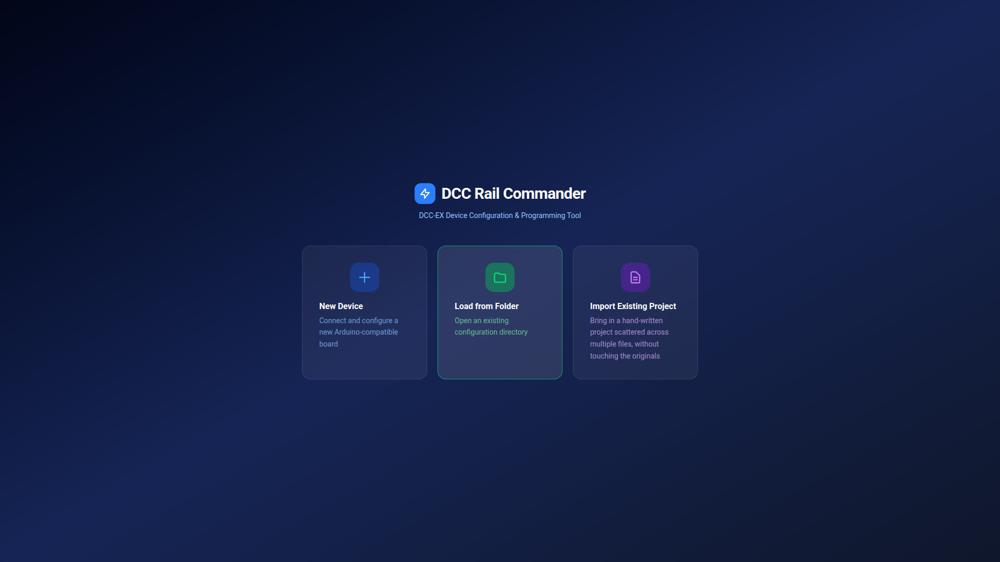
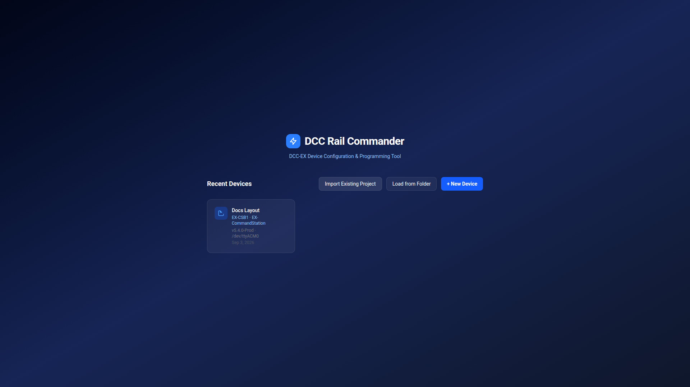

# Getting Started

## Installing

Download the installer for your platform from the [Releases page](https://github.com/elitemike/DCC-Rail-Commander/releases):

| Platform | File |
|---|---|
| Windows 10/11 | NSIS installer (`.exe`) |
| Linux | AppImage or `.deb` |
| macOS | `.dmg` |

The app is self-contained — no separate Python or Arduino toolchain install is required. A bundled Python
interpreter and offline PlatformIO Core handle firmware compilation internally.

!!! tip "Building from source"
    If you'd rather run from source or contribute changes, see the
    [repository README](https://github.com/elitemike/DCC-Rail-Commander#readme) for the `pnpm` development
    workflow.

## First launch

The first time you open DCC Rail Commander, you'll see three options, since there are no saved devices yet:

| Option | When to use it |
|---|---|
| **New Device** | You have a board plugged in via USB and want to set it up from scratch. Walks you through the [New Device Wizard](device-wizard.md). |
| **Load from Folder** | You already have a folder of `.h` config files — either from a previous DCC Rail Commander session, or a hand-edited DCC-EX project that already has `config.h`. |
| **Import Existing Project** | You have an EX-RAIL project scattered across files that were never created by this app (turnouts/sensors/routes mixed together by hand). This reads everything, reconciles duplicate aliases, and writes a clean, organized copy into a new folder you choose — your original files are never touched. |

## After you have a device configured

Once you've set up at least one device, the home screen switches to a **Recent Devices** grid instead of the
onboarding cards. Click any card to reopen that configuration in the [Workspace](workspace-overview.md), or use
the toolbar buttons to add another device, load another folder, or import another project.

Each saved device is completely independent — its own configuration files, its own firmware build directory.
Setting up a second device (even the exact same board model, even the exact same physical board again) always
starts from a clean template; it never copies another device's roster, turnouts, or other configuration over.

## Mock mode

If you're evaluating the app without hardware attached, development builds support a `--mock-device` flag that
fakes USB device discovery so you can walk through the full wizard and workspace. Compiling is always real
against the bundled toolchain — only device discovery and firmware upload are faked. You'll see a **DEV MOCK**
badge in the title bar whenever mock mode is active, so it's never ambiguous whether you're driving real
hardware.

## Next steps

- New board in hand → [New Device Wizard](device-wizard.md)
- Already have config files → jump straight to [Workspace Overview](workspace-overview.md)
