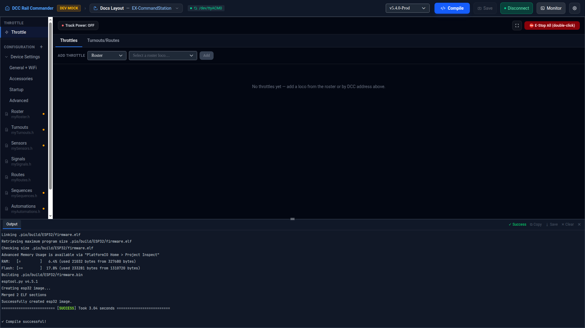

# Serial Monitor

The Serial Monitor is a terminal view of the raw serial connection to your device — see the exact DCC-EX
command/response traffic, type native `<...>` commands by hand, and get autocomplete and inline help for both
native commands and EXRAIL. Open it from the **Monitor** button in the title bar; it lives in the bottom panel
next to Output.

## Status and quick commands

The header bar shows the connection status (port name when connected, otherwise "Disconnected") and a row of
quick-send buttons for common commands, grouped by color:

| Button(s) | Sends |
|---|---|
| **Status**, **Diagnostics** | `<s>`, `<D>` |
| **Power On** / **Power Off**, **Main On** / **Main Off**, **Prog On** / **Prog Off** | `<1>` / `<0>`, `<1 MAIN>` / `<0 MAIN>`, `<1 PROG>` / `<0 PROG>` |
| **E-Stop** | `<!>` — emergency stop, shown in red |
| **List Turnouts**, **List Automations** | `<J T>`, `<J A>` |
| **EXRAIL List** / **Pause** / **Resume** | `</ LIST>`, `</ PAUSE>`, `</ RESUME>` |

Commands sent from elsewhere in the app — for example the E-Stop All / power buttons on the
[Throttle](throttle.md) panel — are echoed into the terminal too (prefixed with `»`), so you can always see
what actually went out over the wire, not just what you typed yourself.

## Typing commands

Type any native DCC-EX command directly, e.g. `<1>` or `<J T>` — it must start with `<` and end with `>`, or
the Monitor rejects it locally without sending anything. Responses are colorized by type: status messages,
errors, version/info lines, power state, and loco (`<l...>`) lines each get their own color, and firmware/debug
text (anything not starting with `<`) is dimmed.

| Key | Does |
|---|---|
| ↑ / ↓ | Step through your last 100 sent commands |
| Tab | Autocomplete — completes a unique match, extends to the longest common prefix, or lists all matches |
| Ctrl+C | Clears the current input line (or copies the terminal selection, if you have text selected) |
| Ctrl+L | Clears the screen |
| `?` or `? <text>` | Shows help — see below |

## Help

Type `?` on its own for the full command reference, or `? <text>` to filter it — the filter matches against
both native DCC-EX commands (with their descriptions) and EXRAIL command names. For example, `? power` lists
every command with "power" in its name or description.

!!! note "View only — this doesn't open or close the connection"
    The Monitor is purely a view over whatever the title bar's **Connect**/**Disconnect** button has already
    done — it never opens or closes the port itself. If it shows "Disconnected", use Connect in the title bar
    first.
