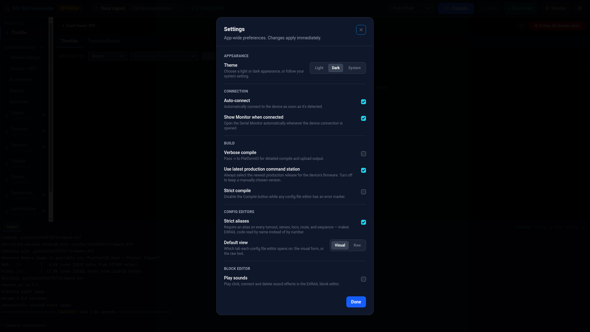

# Preferences

App-wide settings, independent of any single device — open them from the **⚙ Settings** button in the
workspace title bar. Every toggle applies (and is saved) immediately as you change it; there's nothing to
save separately, so the only button in the dialog is **Done**.

## Appearance

**Theme** — **Light**, **Dark**, or **System** (follows your OS setting).

## Connection

| Setting | Effect |
|---|---|
| Auto-connect | Automatically connects to the device as soon as it's detected. |
| Show Monitor when connected | Opens the [Serial Monitor](monitor.md) automatically whenever the device connection is opened. |

## Build

| Setting | Effect |
|---|---|
| Verbose compile | Passes `-v` to PlatformIO for detailed compile and upload output. |
| Use latest production command station | Always selects the newest production release for the device's firmware. Turn off to keep a manually chosen version. |
| Strict compile | Disables the **Compile** button while any open config file editor has an error marker. See [Compile & Upload](compile-upload.md). |

## Config Editors

| Setting | Effect |
|---|---|
| Strict aliases | Requires an alias on every turnout, sensor, loco, route, and sequence — makes EXRAIL code read by name instead of by number. |
| Default view | Which tab each config file editor opens on: **Visual** (form controls) or **Raw** (text). |

## Block Editor

**Play sounds** — plays click, connect, and delete sound effects in the EXRAIL block editor.

## Updates

Shows the version of DCC Rail Commander you're running, and whether a newer one is available.

| Setting | Effect |
|---|---|
| Check for updates | Checks GitHub for a newer release right now. If there is one, the update dialog opens with its release notes — even if you previously chose **Skip this version**. |
| Check automatically | Checks once, a few seconds after the app starts. Turn off to keep the app from contacting GitHub except when you press **Check for updates** (fetching DCC-EX firmware still needs network access). |

When an update is found, the update dialog shows the release notes for every version newer than the one
you have, newest first. From there:

- **Download update** downloads it in the background. You can close the dialog with **Later** while it downloads.
- **Restart & install** closes the app, installs the update, and reopens it. If you have unsaved configuration
  changes, you're asked first. If you choose **Later** instead, the update installs the next time you quit.
- **Skip this version** stops the automatic check from asking about this version again. A newer release will
  still be offered.

Updates are only available in the installed app.

!!! tip "Theme and default view apply everywhere"
    Theme and Default view take effect immediately across the whole app, including editors already open — no
    need to reopen a file or restart to see the change.
