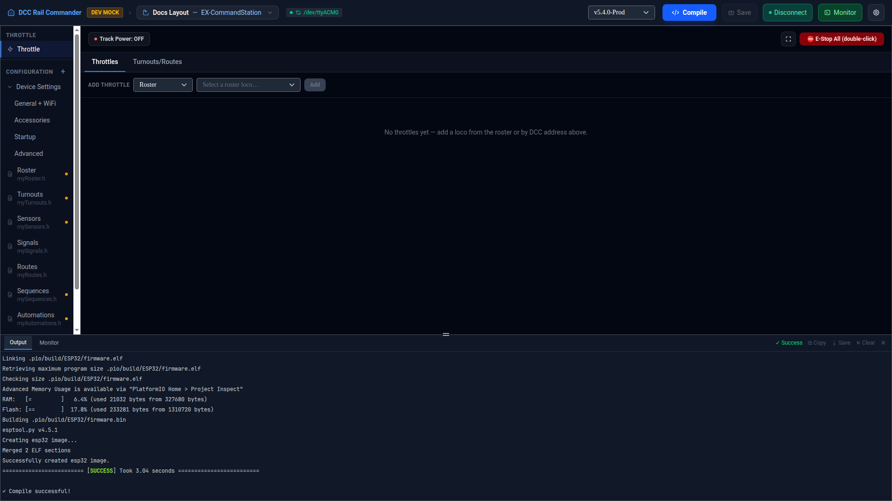

# Throttle

The Throttle panel is a live DCC throttle for driving locomotives directly from the app while connected to
your device — speed, direction, and function control for as many locomotives at once as you want to acquire,
plus quick views for firing routes and turnouts without leaving the throttle. It only appears in the left
navigation while the device is connected.

## Track power and E-Stop

The header bar always shows track power state — **Track Power: ON** / **OFF** / **—** (unknown, before the
device has reported it) — as a single toggle button: click it to turn power on directly, or to turn it off
(with a confirmation, since every loco on the layout stops immediately). **⛔ E-Stop All** requires a
double-click and stops every locomotive on the track at once.

A full-screen button expands the whole panel (every acquired throttle card) to fill the window; exiting native
full screen with Esc or your OS's own controls keeps the app in sync automatically.

## Adding a throttle

Use the **Add Throttle** row above the throttle grid:

1. Choose **Roster** or **Address** from the mode dropdown.
2. For **Roster**, pick a locomotive from your [Roster](config/roster.md) — only locos not already acquired
   are offered. For **Address**, type a raw DCC address (1–10293).
3. Click **Add**.

Each acquired loco gets its own card in the grid; click the **×** in a card's header to release it (with
confirmation — releasing stops controlling the loco but doesn't stop it, it keeps running at its current speed).

## Driving a locomotive

Each throttle card has:

- **Rev** / **Stop** / **Fwd** buttons — Stop sets speed to 0 without changing direction.
- A speed slider and a numeric stepper, both 0–126 (DCC 128-speed-step mode), kept in sync with each other and
  with any other view of the same loco (another card, or the device echoing the command back).
- A function grid.

### Functions

For a loco matched to a roster entry, the function grid shows only the functions your roster actually defines
for it, labeled by name (e.g. "Light", "Horn") — a function slot the roster marks as unused still takes its
place in the grid but is disabled, since it still occupies a real F-number on the decoder. For a loco added by
raw address (no roster match), all 29 functions (F0–F28) are shown with generic "Fn" labels so you can still
test the loco.

Functions defined as momentary in the roster act as press-and-hold — the function is on only while the button
is held down. Other functions are latching toggle buttons: click to turn on, click again to turn off.

## Turnouts and Routes

Switch to the **Turnouts/Routes** tab (next to **Throttles**) for quick access to your layout's routes and
turnouts without leaving the throttle panel:

- **Routes** lists each configured route with a live **Active**/**Inactive** status (derived from the state of
  the turnouts it throws/closes) and a **Trigger** button to run it.
- **Turnouts** lists each configured turnout with its live state — **Unknown**, **Thrown**, or **Closed** — and
  a toggle button; toggling from Unknown throws the turnout.

!!! note "Not the same as the Startup defaults"
    Throwing/closing a turnout here changes it live on the connected device. It doesn't change the turnout's
    configured default state — that's set separately in [Startup](config/startup.md).
