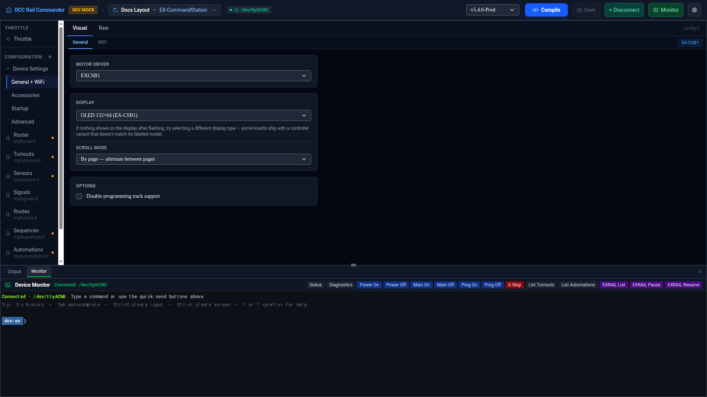

# Workspace Overview

The Workspace is where all configuration editing, compiling, and uploading happens. It opens automatically
after the [New Device Wizard](device-wizard.md) finishes, or when you load a saved/loaded device from the home
screen.

## Title bar

| Control | What it does |
|---|---|
| **DCC Rail Commander** (top-left) | Returns to the home screen. |
| **Device / product selector** | Shows the active device's name and product (e.g. "CSB1 — EX-CommandStation"). Click to open a dropdown of every saved device — switch between them, remove one, or **Add New Device** to launch the wizard again. |
| **Port badge** | Shows the currently assigned serial port and a live connection-status dot (green = connected, red = not detected, grey = unknown). Click to rescan and reassign the port — useful when the OS hands your board a different port after a reconnect. |
| **Firmware version selector** | The Git tag that will be checked out on the **next** Compile. Changing it doesn't rebuild immediately. |
| **Compile** / **Compile & Upload** | Builds firmware against the bundled offline PlatformIO toolchain. In mock/dev builds this is **Compile** only (no real hardware to flash); production builds show **Compile & Upload**, which flashes the connected board immediately after a successful build. Disabled if no device/port is selected, or (with Strict Compile on) while any open editor has an error. |
| **Save** | Opens the **Review Changes** dialog, showing a diff of every modified file — review and confirm from there. The button is disabled with no pending changes, and shows a small blue dot when there are. |
| **Connect / Disconnect** | Opens or closes the actual serial connection to the board. This is independent of the Monitor panel below — Monitor is just a *view* over whatever connection state this button controls. |
| **Monitor** | Toggles the Monitor tab in the bottom panel on or off. Doesn't affect the connection itself. |
| **⚙ Settings** | Opens app-wide [Preferences](preferences.md) — auto-connect, verbose compile output, default firmware version, and more. |

## Left navigation

The left strip lists everything you can edit for the active device, split into a few groups:

- **Throttle** *(only shown while connected)* — a live DCC throttle for driving locomotives directly from the
  app. See [Throttle](throttle.md).
- **Configuration** — your custom EX-RAIL files (roster, turnouts, sensors, etc.), each showing a colored dot
  when it has errors (red) or objects still needing an alias under Strict Aliases (amber). Click **+** to
  create a new, purpose-named file for hand-written EXRAIL code — it's automatically wired into the build via
  `myAutomation.h`'s include list.
- **Device Settings** *(expanded by default)* — hardware-level configuration, covered in its own section below.
- **Examples** *(when present)* — read-only reference files the product's firmware repository ships (e.g.
  `myAutomation.example.h`), shown for reference only; they aren't part of your build.

### Device Settings

A tree with four children, each mapping to a different slice of the underlying config files:

| Item | Edits |
|---|---|
| [General + WiFi](config/general-wifi.md) | `config.h` / `myConfig.h` — motor driver, display, WiFi. |
| [Accessories](config/accessories.md) | HAL accessory boards (I2C multiplexers, PCA9685/PCA9555 boards, etc.) — a slice of `myAutomation.h`'s managed HAL Devices block. |
| [Startup](config/startup.md) | `myStartup.h` — track power/mode at boot and turnout default states. |
| [Advanced](config/advanced.md) | `myAutomation.h` itself — the file that links every other config file together. Deliberately not labeled "Automation" (that would collide with EXRAIL's own `AUTOMATION()` blocks); it's always shown as raw text, since there's nothing structured left in it to justify a Visual tab. |

## Visual and Raw editors

Every configuration file editor (except Advanced) has a **Visual** / **Raw** toggle. Visual shows form
controls and lists tailored to that file's content — roster entries, turnout definitions, and so on. Raw shows
the exact text that will be written to the device, in a Monaco editor with the same syntax highlighting and
error squiggles VS Code uses. Edits in either view sync to the other; nothing is hidden from you, and you can
hand-edit the raw text at any point without losing the ability to go back to Visual (unless what you typed
can no longer be parsed into the visual model — see each file's own page for what that means for that file).

## Bottom panel: Output and Monitor

- **Output** — the live compile log. **⧉ Copy**, **⭳ Save**, and **✕ Clear** act on this log; ✓/✗ next to the
  tab shows the last compile's result at a glance.
- **Monitor** *(when toggled on)* — the device's serial output, once connected. See [Serial Monitor](monitor.md).

Close the whole panel with the **✕** at the far right of the tab bar; toggle Monitor back on from the title bar
whenever you need it again.
